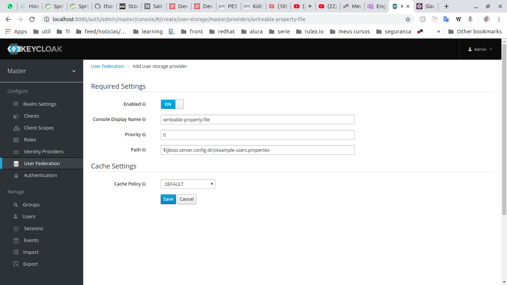

### Run wildfly on standalone mode
keycloackinstalation/bin/standalone.sh

#### Deploy
mvn clean install wildfly:deploy

### Configuration  
UserFederation>Add Provider>writable-property-file

Adicionar no menu federation, vai precisar dizer onde está o arquivo .properties, no campo virá preenchido com:

  ${jboss.server.config.dir}/example-users.properties
por padrão esse arquivo fica em fica em: keycloackinstalation/standalone/configuration
  
