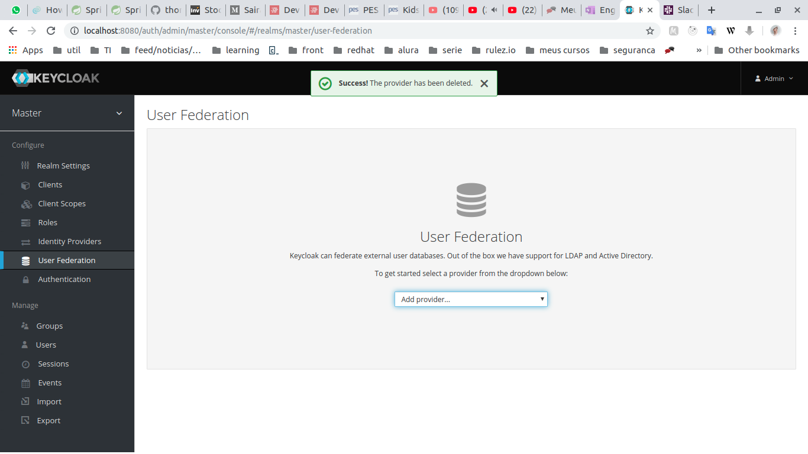

#### Run wildfly on standalone mode
keycloackinstalation/bin/standalone.sh

#### Deploy
mvn clean install wildfly:deploy

#### Configuration  
UserFederation>Add Provider>writable-property-file

Adicionar no menu federation, vai precisar dizer onde está o arquivo .properties, no campo virá preenchido com:

${jboss.server.config.dir}/example-users.properties
 
por padrão esse arquivo fica em fica em: keycloackinstalation/standalone/configuration

Pode utilizar o arquivo src/main/resources/example-users.properties de exemplo 

#### [To start the Keycloak server while also adjusting the port](https://www.keycloak.org/docs/latest/getting_started/):

keycloackinstalation/bin/standalone.sh -Djboss.socket.binding.port-offset=100

After starting Keycloak, go to http://localhost:8180/auth/admin/ to access the admin console.

